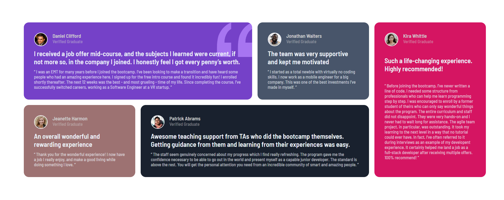

# Frontend Mentor - Testimonials grid section solution

This is a solution to the [Testimonials grid section challenge on Frontend Mentor](https://www.frontendmentor.io/challenges/testimonials-grid-section-Nnw6J7Un7). Frontend Mentor challenges help you improve your coding skills by building realistic projects.

## Table of contents

- [Overview](#overview)
  - [The challenge](#the-challenge)
  - [Screenshot](#screenshot)
  - [Links](#links)
- [My process](#my-process)
  - [Built with](#built-with)
  - [What I learned](#what-i-learned)
- [Author](#author)

## Overview

### The challenge

Users should be able to:

- View the optimal layout for the site depending on their device's screen size

### Screenshot

### Links

- Solution URL: [Solution URL here](https://github.com/Sachinkush0406/Testimonials-grid-section-project)
- Live Site URL: [Live site URL here](https://page06bysachin.netlify.app/)

## My process

### Built with

- Semantic HTML5 markup
- CSS custom properties
- Flexbox
- CSS Grid

### What I learned

In the making of this project I got my hand on the GRID properties in CSS and it was so much fun in making of this project.

Also I change some of the color properties as my choice regarding to the actual project guideline.

## Author

- Website - [Sachin kushwaha](https://app.netlify.com/teams/sachinkush0406/sites)
- Frontend Mentor - [@Sachinkush0406](https://www.frontendmentor.io/profile/Sachinkush0406)
- LinkedIn - [@sachinkush0406](https://www.linkedin.com/in/sachinkush0406)
